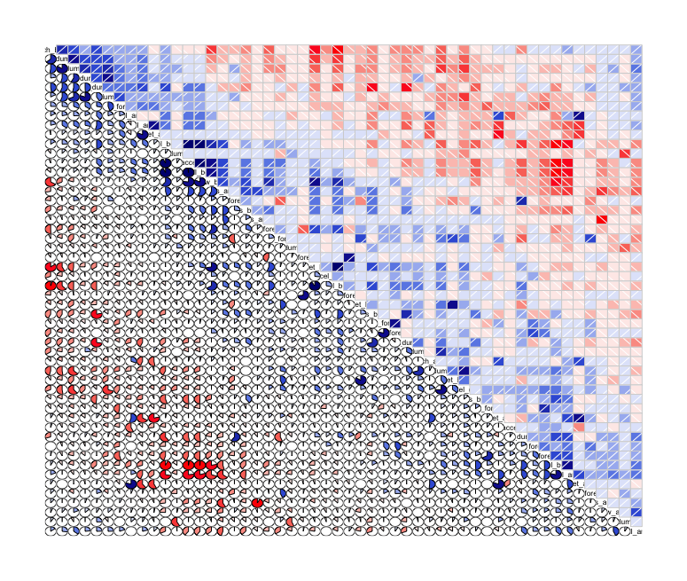

:warning: The compiled HTML version of this Analysis.Rmd file is available from the repo.

# Practical Machine Learning - Week 4 Project

## Introduction

The goal of this project was to use data from accelerometers on the
belt, forearm, arm, and dumbel to determine how well a participant was
performing barbell lifts. To provide input information, six participants
were asked to perform barbell lifts correctly and incorrectly in 5
different ways.

More information is available from the website here: http://groupware.les.inf.puc-rio.br/har
(see the section on the Weight Lifting Exercise Dataset).

###Data Sources

Training data can be downloaded from [Training Data](http://d396qusza40orc.cloudfront.net/predmachlearn/pml-training.csv)

Testing data can be downloaded from [Testing Data](http://d396qusza40orc.cloudfront.net/predmachlearn/pml-testing.csv)


### About the Code Snippets

The snippets in this document can be executed sequentially assuming the
following libraries have been imported:

```{r include = FALSE}
library(caret)
library(corrgram)
```

... and the files have been loaded into the `lifts.train` and
`lifts.test` data frames, e.g. using:

```{r ,include = FALSE}
trainUrl <- "http://d396qusza40orc.cloudfront.net/predmachlearn/pml-training.csv"
testUrl <- "http://d396qusza40orc.cloudfront.net/predmachlearn/pml-testing.csv"
lifts.train <- read.csv(url(trainUrl), na.strings=c("NA","#DIV/0!",""))
lifts.test <- read.csv(url(testUrl), na.strings=c("NA","#DIV/0!",""))
```

The full code is available in the `pmlproject.R` R script in this [GitHub
repository](https://github.com/vvrsk/PracticalMachineLearning/tree/master/Project). The `pmlproject.R` file only includes the code necessary to train the selected model and generate the prediction, code for generating plots or testing alternative models are commented out.

## Plan

At first, we have to learn about the data, find out which data can be
useful for prediction and which data cleansing must be done to make the
data usable.

At a glance (or by running `dim(lifts.train)` and `dim(lifts.test)`), we
can see that both files have 160 columns, and the training set has 19622
dimensions. We have to explore options how to simplify the feature space
by removing irrelevant or duplicate features. We can also consider
applying principal component analysis; even though it will make our results
harder to interpret.

In short, the plan is as follows:
- Explore the data visually, identify and apply necessary data cleansing
- Simplify the feature space by identifying highly correlated features;
create another feature set by applying PCA
- Select and train the promising algorithm with cross-validation
- Select the best performing one based on the OOB error estimate from cross-validation
- Run the prediction

## Data Exploration and Cleansing

### Rows

The training data include rows with the `new_window` column set to `yes`
that hold aggregated information (columns with prefixes such as `kurtosis_`,
`skewness_`, `max_`, `min_`. For the sake of simplicity, these rows will
not be including in the model training.


### Columns

The testing data set has many columns empty or including NA values (most
of them seem to be the columns dedicated for aggregated information).
These don't add any value neither for prediction nor training.

Similarly, the metadata columns (sequence number, `user_name`,
timestamps, `new_window` and `no_window`) will be removed.

As we can see by running `dim(lifts.train)`, we have left with 53 columns after the cleansing:

```{r}
 dim(lifts.train)
```

### Correlations

A quick look at correlations may suggest whether we could simplify the
data set further by identifying pairs of strongly correlated variables:

```{r}
lifts.test.nona <- lifts.test[ , colSums(is.na(lifts.test)) < nrow(lifts.test) ]
names.nona.variables <- names(lifts.test.nona)
names.nona.variables <- names.nona.variables[(names.nona.variables %in% names(lifts.train))]
names.nona <- append(names.nona.variables, 'classe')

lifts.train = lifts.train[names.nona]

 lifts.train.sample = lifts.train[sample(nrow(lifts.train), 500), ]
corrgram(lifts.train.sample, order = TRUE, lower.panel=panel.pie)
```



It looks like it did not reduce the feature space significantly. Let's try
the following options:
- All 53 features we have got after the initial data cleansing
- Apply PCA before training the model (it will make the model impossible to interpret - it might be an issue in some real life scenarios but it was clearly not a requirement for this exercise)

#### Multi Scatter Plot

The following chart provides an visualization of dependencies between individual pairs
of variables and the `classe` variable:

```{r eval = FALSE}
pairs(lifts.train.sample, pch = 21,
    bg = c("red", "green3", "blue", "yellow", "green")[unclass(lifts.train.sample$classe)])
```

The output is available in the [multi-scatter.pdf]() file in the GitHub repository (9 MB PDF - may crash your Adobe Reader). Due to time limitations, I did not spend much time analyzing these dependencies.

## Prediction Models

For prediction, random forest model will be trained, we will test a version with all 53 variables as well as a version with feature space reduced by PCA. In both cases, we will train the model with 5-folds cross-validation to estimate an out-of-saple error.

The following code was used to train the model with all features:
```{r message=FALSE}
fitRfCv <- train(classe ~ ., data = lifts.train, ntree = 100, method = 'rf',
    trControl = trainControl(method = "cv", number = 5))
```

... and the following one applies the PCA pre-processing using caret's default 0.95 threashold:

```{r message=FALSE}
fitRfPcaCv <- train(classe ~ ., data = lifts.train, ntree = 100, method = 'rf',
    preProcess = "pca", trControl = trainControl(method = "cv", number = 5))
```

After the training, we can display the `fitRfCv$finalModel` and `fitRfPcaCv$finalModel`
to see the OOB estimate and confusion matrix:

### All features (`fitRfCv$finalModel`)

```
        OOB estimate of  error rate: 0.47%
Confusion matrix:
     A    B    C    D    E class.error
A 5464    4    1    1    1 0.001279474
B   17 3697    4    0    0 0.005648198
C    0   12 3329   11    0 0.006861575
D    0    2   26 3118    1 0.009215126
E    0    0    2    9 3517 0.003117914
```

### PCA (`fitRfPcaCv$finalModel`)

```
        OOB estimate of  error rate: 2.07%
Confusion matrix:
     A    B    C    D    E class.error
A 5433    9   19    6    4 0.006945714
B   59 3618   35    1    5 0.026896181
C   10   42 3263   34    3 0.026551313
D    4    4   99 3032    8 0.036542739
E    3   11   23   18 3473 0.015589569
```

The model with all features clearly performs better than the one with PCA pre-processing.

## Prediction

The `predict(fitRfCv, lifts.test)` gives us the prediction generated by the choosen model from the testing data set:

```{r message=FALSE}
lifts.prediction = predict(fitRfCv, lifts.test)
lifts.prediction
```

